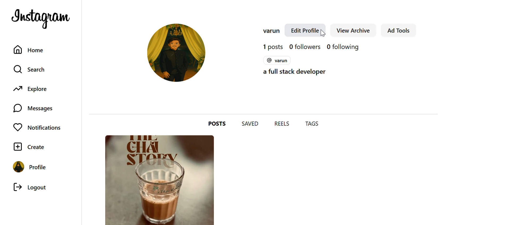
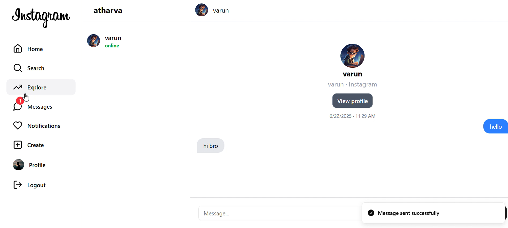
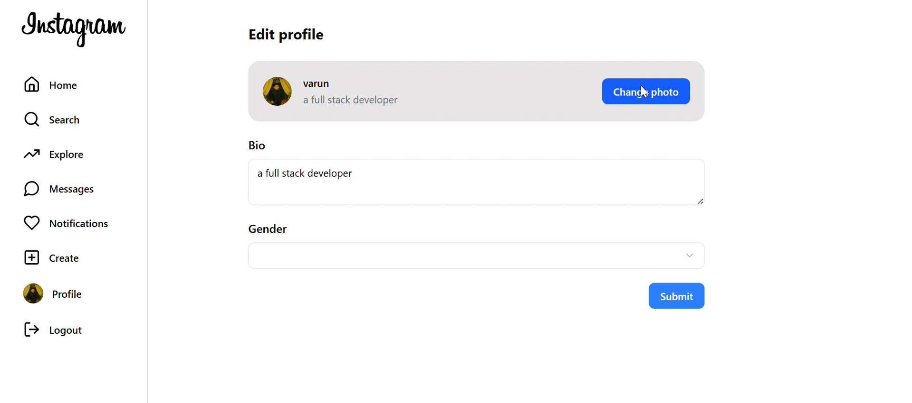
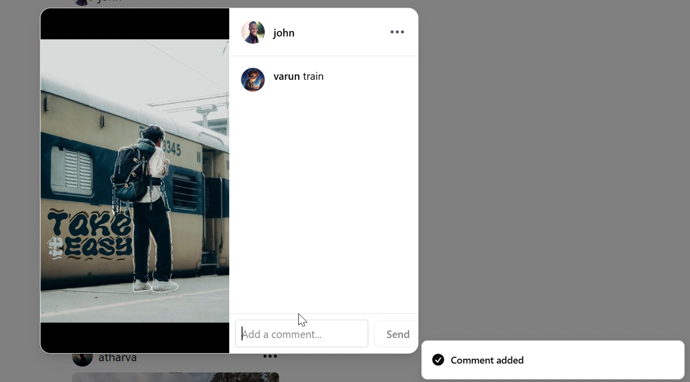
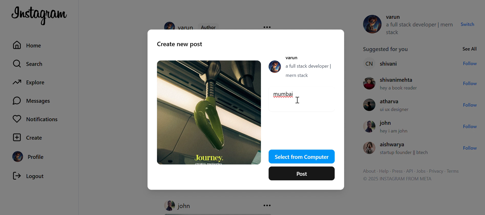
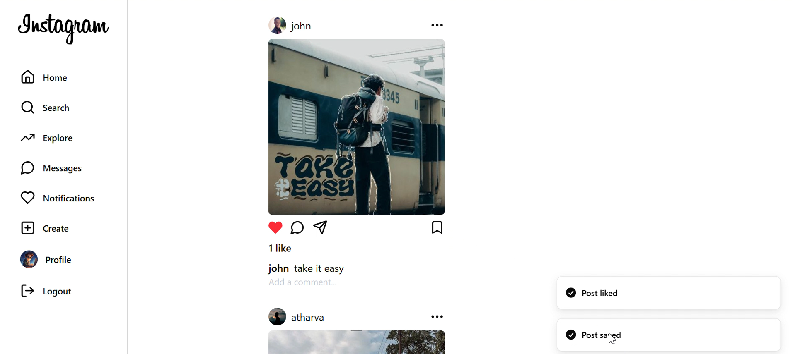

# 📸 Instagram Clone (Full-Stack MERN App)

A complete **Instagram clone** built from scratch using the **MERN stack** — not just a UI replica, but a fully functional social media app with real-time features.

---

## 🚀 Features

✅ **Authentication & Authorization**
- Secure login/signup using **JWT** tokens
- Session persistence via token storage

📸 **Post Feed**
- Create, like, comment, and save posts
- Delete your own posts
- Real-time like/unlike notifications

👤 **User System**
- Follow/unfollow users
- View other users' profiles
- Edit your own profile info & avatar

💬 **Real-Time Chat**
- Chat with users you follow
- Real-time messaging with notifications
- Online/offline status indicators (just like Instagram)

🔔 **Real-Time Notifications**
- Get notified instantly when your post is liked/disliked
- Receive message alerts in real time

---

## 📸 Screenshots

###  Home Feed

###  Chat System

###  Edit Profile Page

###  Comment Post 

###  Create Post 

###  Like And Save Post 

---

## 🧪 Tech Stack

### 🖥️ Frontend
- **React.js**
- **React Store** (for global state management, avoids prop drilling)
- **Axios** for API requests

### 🛠️ Backend
- **Node.js**
- **Express.js**
- **Socket.IO** for real-time communication

### 🗄️ Database & Storage
- **MongoDB** with **Mongoose**
- **Cloudinary** for image uploads

